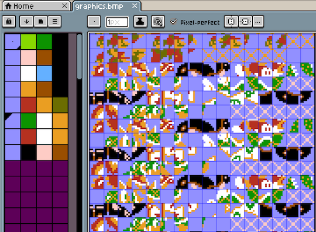

# Bmp2chr

Cross-platform command line tool to convert an indexed-color bitmap (.bmp) into CHR data for use in developing Nintendo Entertainment System (NES) ROMs.



<br><br>

# Image Requirements

Bitmaps should use indexed color mode, be 128px wide, height should be a multiple of 8px.

Pixel values are assigned by palette_index % 4, so multiple 4-color palettes can be used in the same bitmap if you so desire, and it will all get "flattened" to 2bpp pixel data.

The palettes themselves are not imported, so it's up to you to use colors that resemble in-game colors.
<br><br>

# Usage

On the command line:
```bmp2chr mybitmap.bmp```
<br><br>

# Build

Just run ```cargo build``` to compile or download binaries from releases.
